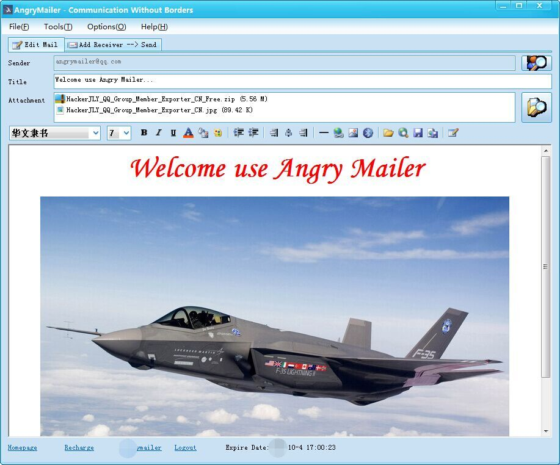
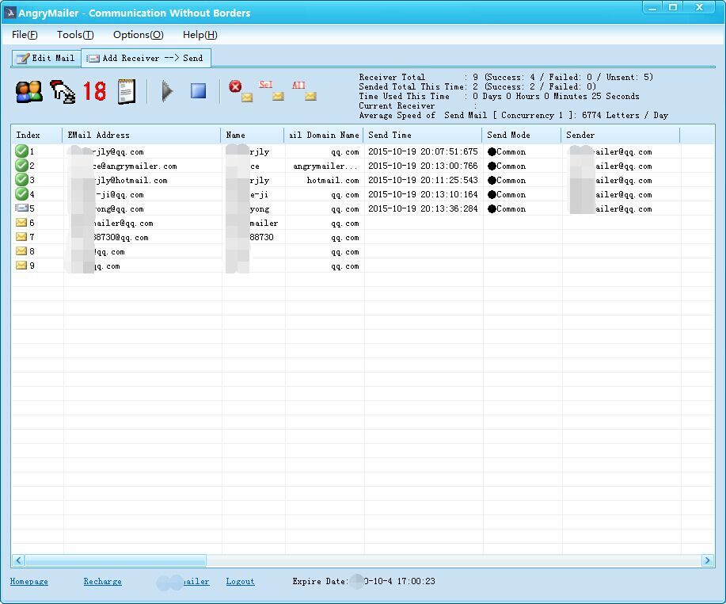

  

<h1 align="center">AngryMailer</h1>

A professional Windows bulk email sender for personalized email campaigns.

  

[English](README.md) | [简体中文](README.zh-CN.md)

---

## Introduction

AngryMailer is a powerful Windows desktop application for sending bulk emails through SMTP servers.

It supports personalized emails, mailing list management, HTML emails, attachments, scheduled sending, and multiple SMTP accounts, making it suitable for businesses, developers, and organizations that need reliable email delivery.

---

## Features

* 🚀 High-performance bulk email sending
* 📧 Standard SMTP support
* 👤 Personalized emails using merge fields
* 📄 Import recipients from Excel or CSV
* 📎 File attachment support
* 📝 HTML and Plain Text emails
* 🔄 Multiple SMTP accounts with automatic rotation
* ⏰ Scheduled email sending
* 📊 Real-time sending statistics
* 🔍 Failed email retry
* 🚫 Duplicate email filtering
* 📋 Email template management
* 💾 Mailing list management
* 🌍 Unicode and multilingual support
* 💻 Native Windows desktop application

---

## Screenshots

### Main Window

### Sending Emails

---

## Typical Use Cases

* Email marketing
* Product announcements
* Customer notifications
* Newsletter distribution
* Event invitations
* Internal company communications

---

## System Requirements

* Windows 7 / 8 / 10 / 11
* Internet connection
* SMTP server account

---

## Download

<a href="https://github.com/HackerJLY/Angry-Mailer/releases/latest">

https://github.com/HackerJLY/Angry-Mailer/releases/latest

</a>

---

## Official Website

https://www.angrymailer.com

---

## Documentation

For product information and user guides, please visit:

https://www.angrymailer.com/index.php/en/Product

---

## License

Copyright © AngryMailer.

All rights reserved.

This repository is used for software releases, documentation, issue tracking, and product information.
