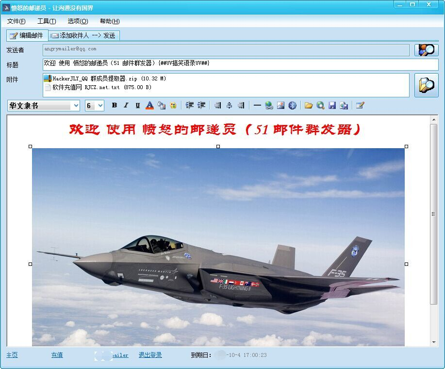
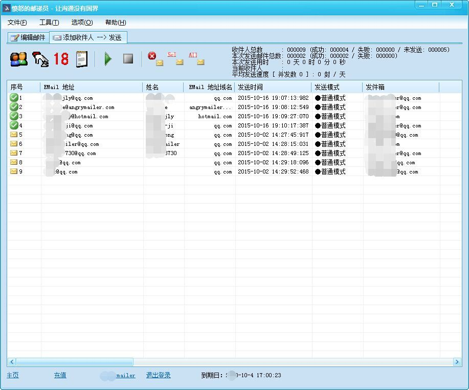

  

<h1 align="center">AngryMailer</h1>

专业的 Windows 邮件群发软件，支持个性化邮件发送。

  

简体中文 | [English](README.md)

---

## 产品介绍

AngryMailer 是一款专业的 Windows 桌面邮件群发软件，可通过 SMTP 服务器高效发送大量邮件。

软件支持个性化邮件、收件人管理、HTML 邮件、附件发送、定时发送、多 SMTP 账号轮换等功能，适用于企业、开发者以及需要批量发送邮件的个人用户。

---

## 功能特点

* 🚀 高性能邮件群发
* 📧 支持标准 SMTP 协议
* 👤 支持邮件个性化（邮件合并）
* 📄 支持 Excel、CSV 导入收件人
* 📎 支持邮件附件
* 📝 支持 HTML 邮件和纯文本邮件
* 🔄 多 SMTP 账号自动轮换
* ⏰ 定时发送邮件
* 📊 实时发送统计
* 🔍 失败邮件自动重试
* 🚫 自动过滤重复邮箱
* 📋 邮件模板管理
* 💾 收件人列表管理
* 🌍 支持 Unicode 和多语言
* 💻 原生 Windows 桌面应用

---

## 软件截图

### 主界面

### 邮件发送

---

## 适用场景

* 邮件营销
* 产品发布通知
* 客户通知
* 新闻邮件（Newsletter）
* 活动邀请
* 企业内部通知

---

## 系统要求

* Windows 7 / 8 / 10 / 11
* 网络连接
* SMTP 邮件服务器账号

---

## 下载

<a href="https://github.com/HackerJLY/Angry-Mailer/releases/latest">

https://github.com/HackerJLY/Angry-Mailer/releases/latest

</a

---

## 官方网站

https://www.angrymailer.com

---

## 产品介绍

更多产品介绍、使用说明和帮助文档，请访问：

https://www.angrymailer.com/index.php/zh-hans/Product

---

## 许可证

Copyright © AngryMailer.

保留所有权利。

本仓库主要用于软件发布、文档维护、问题反馈以及产品介绍。
